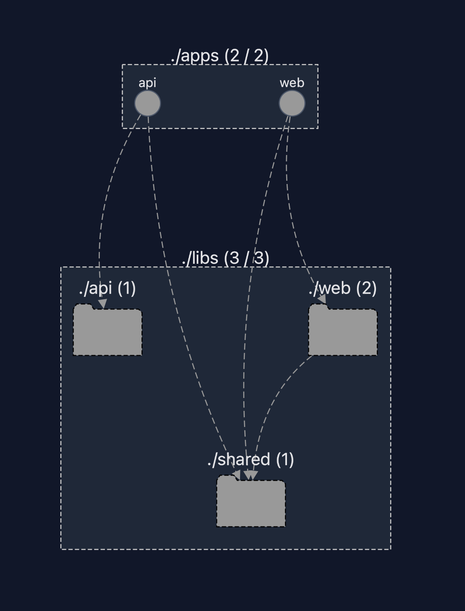
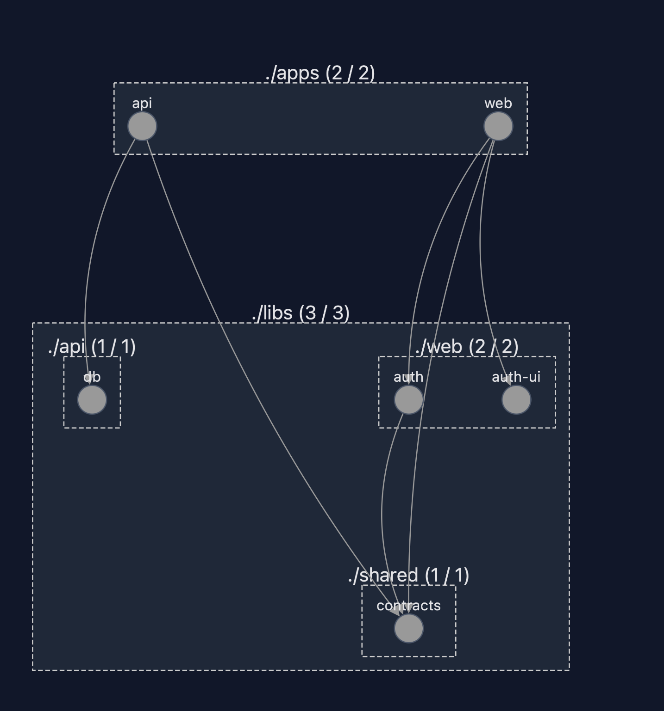

# Architecture – Nx Full Stack Auth App

## Objectives

* Nx Monorepo with clear separation between frontend (React) and backend (NestJS)
* Reuse via shared libraries (types/contracts, ui, server modules)
* End-to-end TypeScript typing
* Incremental evolution driven by the roadmap

---

## Nx Structure (high-level)

### Apps

* `apps/web`
React Frontend (React Router, shadcn/ui, daisyUI)
* `apps/api`
NestJS Backend (Auth, Users, Upload, Drizzle)

### Libs (planned)

* `libs/shared/contracts`
Shared DTOs/types
* `libs/shared/utils`
Common utilities (e.g., formatting, helpers)
* `libs/web/ui`
Reusable UI components (layout, form fields, etc.)
* `libs/web/auth`
Auth context, hooks, API client wrapper
* `libs/api/db`
Drizzle config, schema, migrations
* `libs/api/auth`
JWT, guards, strategies, session handling
* `libs/api/users`
Profile CRUD and access history
* `libs/api/files`
Avatar upload and static serving

> Note: libs will be created only when necessary (YAGNI).

---

## Backend (NestJS)

### Main Modules (planned)

* AuthModule
* UsersModule
* FilesModule
* Common (filters/interceptors/guards)

### Cross-cutting concerns

* CORS
* Global ValidationPipe
* Consistent error handling (HTTP exceptions / filter)
* Logging (Nest Logger / interceptor)
* Rate limiting (optional)

## Current Status (Milestone 2)

### Implemented Modules

* `DatabaseModule`
Exposes a DI provider (`DB`) supplying the shared Drizzle client (`libs/api/db`).
* `AuthModule`
Contains:
* `AuthController` (`POST /auth/register`, `POST /auth/login`)
* `MeController` (`GET /me`, `GET /me/access-history?limit=5`)
* `AuthService` (registration, login, and access history logic)
* `JwtAuthGuard` (route protection via `Authorization: Bearer <token>` header)

### Authentication Flow (Implemented)

* **Register**
* Input validation via Zod (`libs/shared/contracts`)
* Password hashing with bcrypt
* Insert into `users` table
* Duplicate email handling with `409 Conflict`

* **Login**
* User lookup by email
* Password verification with `bcrypt.compare`
* Normalized errors with `401 Unauthorized` to prevent user enumeration
* JWT access token generation (short or long expiry with `rememberMe`)
* Access log writing to `access_logs` table

### Protected Routes (Implemented)

* `GET /me` → returns the authenticated user's profile
* `GET /me/access-history?limit=5` → returns recent logins (default 5)

### Error Handling (Current Status)

Currently, the API uses:

* Standard NestJS exceptions (`BadRequest`, `Unauthorized`, `Conflict`)
* Custom error shape for Zod (`{ message, errors }`)

Full response normalization (e.g., via global filter/interceptor) is planned as UX polish.

---

## Database (PostgreSQL – Neon)

### Tables (Current Status)

* `users`
* `access_logs`

### Future Tables (Optional)

* `sessions` / `refresh_tokens` (for remember me)

> Note: `sessions` / `refresh_tokens` is optional and will be evaluated only if a refresh token implementation is decided.

### Migrations & Seed

* Drizzle migrations executed on cloud DB
* Minimal seed (optional)

---

## Frontend (React)

* Routing: `/register`, `/login`, `/dashboard` (private)
* Auth context + protected routes
* Error boundaries + loading states
* Toast notifications (UX polish)

---

## Authentication (overview)

* Register → creates user, password hashing, optional avatar
* Login → JWT access token, remember me (session/refresh)
* Dashboard → protected endpoints + logout

---

## Key Decisions

* Package manager: pnpm
* DB provider: Neon (managed PostgreSQL)
* UI: shadcn/ui + daisyUI (theme)
* i18n + string manager: architectural extra (optional)

## Workspace baseline (Nx + TypeScript)

* `nx.json` includes `workspaceLayout` to standardize the `apps/` and `libs/` structure.
* `tsconfig.base.json` is the workspace-level shared TypeScript configuration: individual projects (`apps/*`, `libs/*`) extend this base.

## Data Validation (API)

**Zod** was chosen for API input validation instead of `class-validator`.

This choice is driven by its **better integration with the Nx monorepo architecture** adopted in the assignment, favoring code and contract sharing between frontend and backend.

### Reasons for Choice

* **Single Source of Truth**
Validation schemas are defined once and shared between frontend and backend via the `libs/shared/contracts` library.
* **Native Type Inference**
Zod allows automatically deriving TypeScript types from schemas (`z.infer`), avoiding duplication and potential inconsistencies between DTOs and runtime validation.
* **Explicit Runtime Validation**
Validation is declarative and immediate, without relying on decorators, reflection, or dedicated classes.
* **Greater Control Over Errors**
Errors generated by Zod are easily normalized and mapped to consistent, user-friendly API responses.

Validation is applied via a custom `ZodValidationPipe` integrated into NestJS controllers.

In an **Nx monorepo** context, this solution maintains strongly typed, reusable, and consistent contracts across different applications, reducing the risk of drift between frontend and backend.

## Authentication (JWT)

Authentication is based on **JSON Web Token (JWT)**, as required by the assignment.

* The token is generated upon login
* Includes minimal user information (id, email)
* Token duration is configurable via environment variables
* Support for extended duration via the "remember me" option is provided

Configuration of the JWT module happens asynchronously, reading environment variables via `ConfigModule`.

### Authentication Error Handling

For security reasons, authentication errors are normalized.
The API does not distinguish between "non-existent user" and "wrong password" to prevent
*user enumeration* attacks (an attacker could verify which emails are registered).

## Frontend – Architectural Choice: Auth Logic vs Auth UI

To maintain separation of concerns and favor reuse/modularity in the Nx monorepo,
frontend authentication was split into two libraries:

* `libs/web/auth`
Contains authentication logic:
* token management (storage)
* API calls (`/auth/login`, `/me`)
* global state and hooks (`AuthProvider`, `useAuth`)
* route protection (ProtectedRoute / redirect logic)

* `libs/web/auth-ui`
Contains reusable and "presentational" UI components:
* basic login/register forms
* layout/shell
* components without direct API dependencies

This choice allows to:

* replace or evolve the graphical interface without impacting auth logic
* reuse auth logic in other apps within the monorepo (e.g., admin dashboard) with different UIs
* keep tests more targeted (logic vs rendering)

> Note: The assignment requires a single web app, so the design remains intentionally "light": app-specific extensions/adapters can be introduced only if/when they become necessary (YAGNI).

## Frontend – Routing and Authentication

### Routing and Access Control

The frontend uses **React Router** for navigation management, clearly distinguishing
between public and protected routes.

* Public routes:
* `/login`
* `/register`

* Protected routes:
* `/dashboard`

Protected routes are encapsulated via a dedicated component (`ProtectedRoute`)
acting as an **architectural boundary** between navigation and authentication.

### Frontend Authentication Architecture

Authentication management is centralized in a dedicated library (`libs/web/auth`)
and is based on a global **AuthProvider**.

Main responsibilities of the AuthProvider:

* maintain authentication state (`anonymous`, `loading`, `authenticated`)
* manage user session lifecycle
* expose consistent APIs via hooks (`useAuth`)
* bootstrap the session upon application refresh

At application startup, the AuthProvider:

1. reads the access token from storage
2. if present, invokes the `GET /me` endpoint
3. updates the global state based on the outcome

### Token Persistence Strategy

Access token persistence depends on user choice:

* `rememberMe = true` → `localStorage` (persists across browser restarts)
* `rememberMe = false` → `sessionStorage` (valid only for the current session)

This strategy balances UX and security, without introducing premature complexity (e.g., refresh tokens).

### Error Handling and Application Stability

An `ErrorBoundary` is mounted at the application root level to catch
unhandled runtime errors and prevent the interface from crashing completely.

This approach ensures greater frontend robustness and isolates critical errors
from the rest of the user experience.

## Architecture Overview

The project follows a clear separation between applications and reusable libraries.

This separation allows applications to act as thin entry points, while the core logic lives in reusable libraries.

## Dependency Graph

To verify that the architecture is correctly enforced, Nx provides a dependency graph.

The graph shows that applications depend only on libraries, and shared contracts are reused across frontend and backend.
